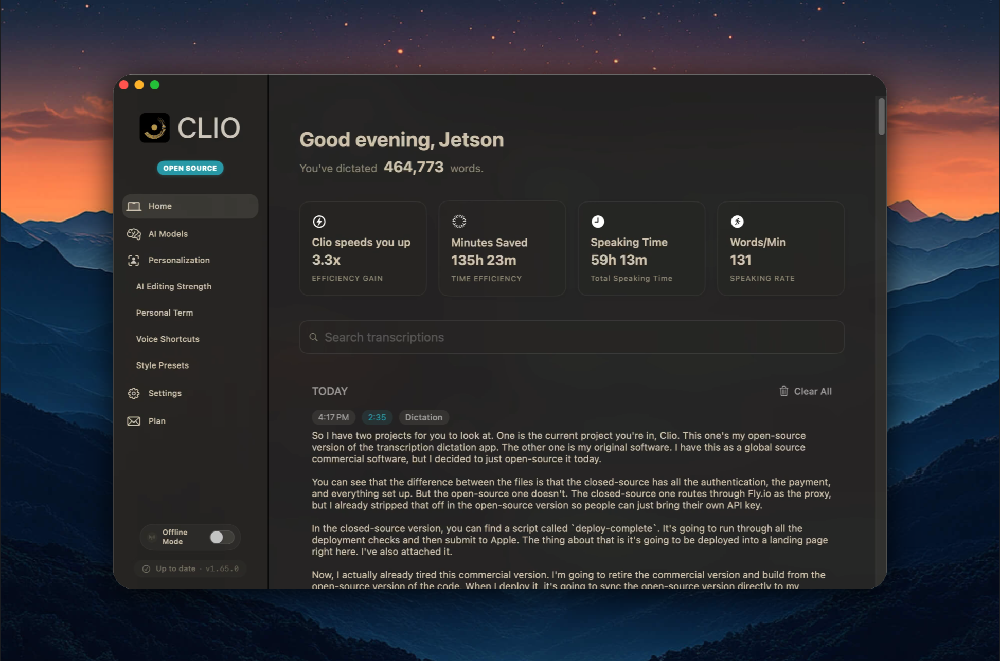
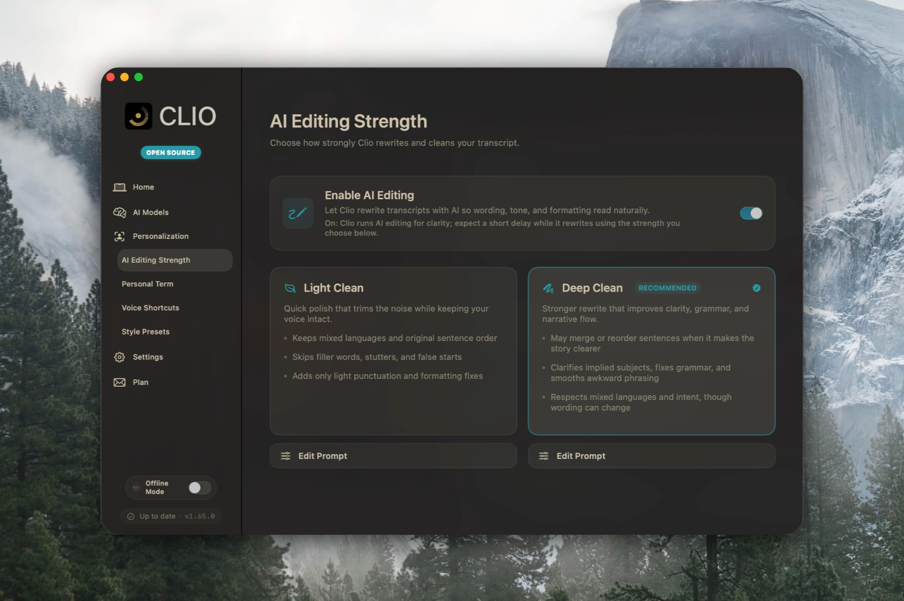
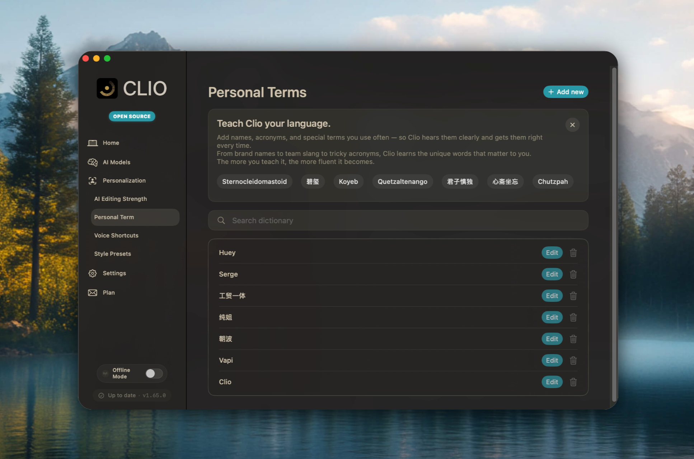

# Clio

**macOS dictation that feels personal, intentional, and yours**
<p align="center">
  
</p>

[](https://www.gnu.org/licenses/gpl-3.0)


---

## Why Share This Now

Only about 0.3 percent of people on Earth ship professional software today. That number will explode as AI turns curious problem-solvers into confident builders, and I want Clio to be proof that the door is already open. I wrote this app without prior Swift experience, learned macOS development on the fly, and somehow went from concept to revenue with thousands of users.

Voice is a crowded vertical with teams like Wispr Flow, Aqua, and Superwhisper raising tens of millions of dollars. Clio will not be the first or the most funded dictation product, but it can be the most generous: a full stack that treats voice as infrastructure and refuses to hide behind subscriptions. If I cannot be the first or the best in a category, I would rather open source the work than chase it as a part-time cash flow project, so the entire codebase is now available for the community to build on.

Take this repo as inspiration and curriculum. Read the code, fork the UI, swap the models, wire up your own automations. AI will keep lowering the threshold between an idea and its implementation, and the best way to prepare is to build something real. Clio is my love letter to that future.



---

## A Builder's Note

In Feb 2025 I opened a blank Swift file with a simple promise to myself: *maybe voice could make my Mac feel quieter*. I had never shipped a macOS app, never lived inside AppKit, and definitely did not expect to learn audio pipelines, CoreML quirks, and Accessibility APIs all at once. Clio began as a private tool so I could think out loud, transcribe fast, and keep everything on my machine.

Somewhere between debugging hotkeys at 2 a.m. and teaching myself SwiftUI by brute force, the project stopped being “for me only.” Dictation deserves to be infrastructure-not a gated SaaS add-on or yet another subscription. So I’m open-sourcing the entire stack, hoping other builders will treat voice as a primitive we can improve together. If you are reading this, consider it an invitation to add your own rituals, shortcuts, and ideas to Clio.

---

## Why Clio Exists

- **Voice as infrastructure**: A locally owned pipeline that slots into any workflow instead of asking you to relocate your thoughts to a web app.
- **Privacy without performance trade-offs**: Whisper.cpp, Metal acceleration, and the Keychain mean fast transcription with zero server round-trips.
- **Context-aware by default**: Clio keeps track of the foreground app, cursor position, and your chosen presets so dictation already matches the space you’re working in.
- **For builders, writers, and tinkerers**: Pull it, fork it, gut it-Clio is documented, scriptable, and ready for your own experiments.

---

## What You Get

### 🎙️ Fluent Dictation
- Soniox v3 streaming ASR for sub-300 ms transcription that handles multilingual speech and code-switching with ease
- Push-to-talk, hold-to-record, and automatic cursor insertion so you can stay hands-on with whatever app is open
- Automatic fallback to whisper.cpp for fully offline work plus support for custom GGML models when you want to tinker


### 🧠 Context & Enhancement
- App-aware formatting profiles so writing apps, IDEs, browsers, or comms tools each get their own prompt and voice


- Optional AI enhancement that routes through Groq and Google Gemini (with OpenAI, Anthropic, or local Ollama as alternates) for rewriting, summaries, or tone shifts
- Custom prompts and style presets (“memo,” “stand-up notes,” “support ticket,” etc.) that you can toggle per workflow


- Dial editing strength from “light touch” to “rewrite it for me” without ever leaving the app
- Build personal terminology dictionaries so hotwords stick after one correction



### 🔒 Local-First Security
- Audio never leaves the device unless you explicitly wire up a cloud provider
- API keys live in the macOS Keychain
- Automatic cleanup of temporary recordings and transcripts

### ⚙️ Integrations & Extensibility
- Soniox streaming pipeline for real-time ASR plus Groq and Gemini connectors for AI rewriting
- whisper.cpp submodule for on-device inference when you want zero network access
- Sparkle-powered updates for signed releases
- KeyboardShortcuts + AppKit Accessibility hooks for system-wide hotkeys
- Modular `Services`, `Managers`, and `StateMachine` layout so you can drop in new providers or UI experiments
- Provider configuration UI makes it trivial to mix Groq, Gemini, and Soniox without touching config files


---

## Quick Start

```bash
git clone https://github.com/studio-kensense/clio.git
cd clio
open Clio.xcodeproj
```

### Build in Xcode (recommended)
1. Wait for the project to finish indexing, then pick the `Clio` scheme in the toolbar.
2. Make sure the run destination says `My Mac (Designed for iPad)` or `My Mac`.
3. Press `⌘R` (or click the ▶️ button) to build-and-run.
4. Grant microphone, accessibility, and screen-recording prompts the first time macOS asks.

### Build from the CLI

```bash
xcodebuild -project Clio.xcodeproj -scheme Clio -configuration Debug build
```

Prefer binaries? Download the latest signed DMG from the [Releases](https://github.com/studio-kensense/clio/releases) page, drag to `/Applications`, and grant microphone/accessibility permissions on first launch.

---

## First Launch Checklist

1. **Permissions** – macOS will prompt for Microphone, Accessibility, and (optionally) Screen Recording so Clio can insert text at your cursor and capture on-screen context.
2. **Streaming Credentials** – Paste your Soniox API key under **Settings → Cloud API Keys** to enable low-latency transcription.
3. **Offline Models (optional)** – Drop whisper.cpp GGML models inside `~/Library/Application Support/Clio/Models` if you want an offline fallback.
4. **Hotkeys** – Set global shortcuts for toggle-recording and push-to-talk under **Settings → Shortcuts**.
5. **AI Enhancement Keys (optional)** – Add Groq and Gemini keys so rewriting and tone-shifting can run through your preferred providers.

After that, tap your shortcut, speak naturally, and watch text flow wherever your caret lives-Notes, Xcode, Notion, or even the Terminal.

---

## Workflow Recipes

- **Draft mode** – Assign a writing preset that auto-formats Slack updates or daily journals with headings and bullet styles.
- **Pair-programming journal** – Switch to a “code” profile that disables auto-punctuation, respects camelCase, and keeps markdown fences intact.
- **Meeting memory** – Route long-form audio through Soniox low-latency streaming and hand the transcript to Groq for summaries.
- **Hands-free coding** – Combine push-to-talk with cursor control tools (Raycast, Hammerspoon, etc.) for voice-driven scaffolding.

If you build a workflow worth sharing, drop it in `docs/recipes` (or open an issue) so the rest of us can steal it.

---

## Architecture at a Glance

- `Whisper/RecordingEngine.swift` – Orchestrates recording, VAD, buffering, Soniox streaming handoff, and whisper.cpp fallback.
- `Services/AI/SonioxStreamingService.swift` – Manages the low-latency websocket connection to Soniox v3 and keeps partial transcripts flowing.
- `Services/AI/AIEnhancementService.swift` – Provider-agnostic layer for Groq, Gemini, OpenAI, Anthropic, and Ollama text enhancement.
- `StateMachine/RecorderStateMachine.swift` – Guards every session edge case (lost focus, permission changes, model swaps) so recordings stay resilient.
- `Whisper/whisper.cpp` – The embedded inference engine with Metal + CoreML acceleration for offline scenarios.

Everything is written in Swift with a strict 4-space indent, plenty of structs, and zero force unwraps. Tests live in `ClioTests/` and `ClioUITests/`; Python tooling and CI scripts sit at the repo root.

---

## Roadmap & Community

- **Short term** – polish onboarding, add more preset voices/styles, expose the automation hooks I use daily.
- **Medium term** – ship a plug-in surface so you can call any local LLM or automation script after transcription.
- **Long term** – keep Clio fast, private, and boring in the best possible way. Dictation should feel like a keyboard, not a product funnel.

Issues and PRs are welcome. Please read [CONTRIBUTING.md](CONTRIBUTING.md) for coding style, testing expectations, and how to run the deployment scripts (`build_release.sh`, `create_dmg.sh`, etc.).

---

## License

Clio ships under the **Clio Community License v1.0**, which keeps the code open for personal and non-commercial use while requiring derivative work to remain non-commercial. Need a commercial license? Reach out via issues or email and we can figure out terms. Read the full text in [LICENSE](LICENSE).

---

## Credits

- **boring.notch** – The recorder UI leans on the thoughtful interaction patterns pioneered by [TheBoredTeam/boring.notch](https://github.com/TheBoredTeam/boring.notch).
- **Soniox** – Streaming and batch ASR capabilities are powered by Soniox models; huge thanks for low-latency accuracy.

If your work ends up inside Clio, let me know so I can brag about it here.

---

### Thank You

Clio exists because people keep cheering for indie infrastructure. If this helped you, star the repo, file an issue, or tell me how you are bending it to your workflow. I built this to talk to my Mac without apology; now it’s yours to shape.

- Jetson
