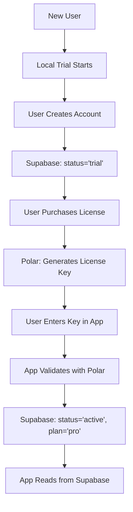
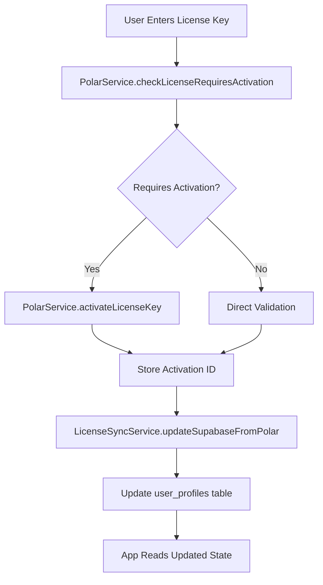
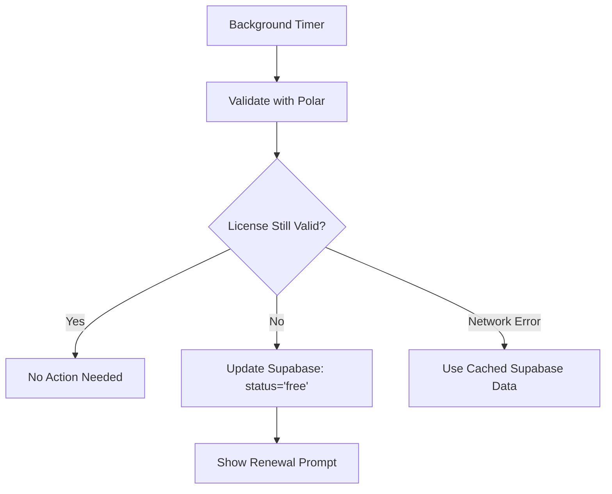

# Polar + Supabase Integration Architecture

**Document Version**: 1.0  
**Date**: 2025-07-28  
**Purpose**: Design proper integration between Polar payment system and Supabase user management

---

## 🎯 Executive Summary

**Problem**: Currently Polar and Supabase compete rather than cooperate, causing authentication conflicts and duplicate trial systems.

**Solution**: Integrate both systems with **Polar as source of truth** for payments/licenses and **Supabase as application state** for fast user management.

**Benefits**: 
- 🚀 Fast app performance (Supabase reads)
- 💰 Reliable payment processing (Polar)  
- 🔒 License validation security
- 📱 Offline capability
- 🔄 Consistent state management

---

## 📊 Current State Analysis

### **Polar Service (Payment System)**
**Location**: `Clio/Services/Authentication/PolarService.swift`

**Capabilities**:
- ✅ License key validation with Polar API
- ✅ Device activation/deactivation 
- ✅ Activation limit management
- ✅ Hardware fingerprinting
- ✅ Product ID: `bea600bb-5259-46bd-99b3-73459e97c595`

**States**:
```swift
enum LicenseState {
    case trial(daysRemaining: Int)
    case trialExpired  
    case licensed
}
```

### **Supabase Service (User Management)**
**Location**: `Clio/Services/Authentication/SupabaseServiceSDK.swift`

**User Profile Fields**:
```sql
-- user_profiles table
subscription_status: "pending_verification" | "trial" | "free" | "active"
subscription_plan: "pro" | "enterprise" | null
subscription_expires_at: timestamp
trial_ends_at: timestamp
trial_words_used: integer
```

### **Current Issues**
- ❌ `DevModeBypassPolar = 1` completely disables Polar
- ❌ Separate trial systems causing conflicts
- ❌ No sync between Polar license state and Supabase subscription status
- ❌ Authentication logic treats systems as mutually exclusive

---

## 🏗️ Integration Architecture

### **Core Principle**
```
Polar (Source of Truth) → Supabase (Application State) → App (Fast Reads)
```

### **System Responsibilities**

| System | Responsibility | Speed | Reliability |
|--------|---------------|-------|-------------|
| **Polar** | Payment processing, license generation, validation | Slow (API) | High (authoritative) |
| **Supabase** | User profiles, app state, cached subscription data | Fast (local) | Medium (cached) |
| **Local Trial** | Fallback when both systems unavailable | Fast (local) | Low (tamperable) |

---

## 🔄 Data Flow Architecture

### **1. New User Journey**


### **2. License Activation Flow**


### **3. Daily Sync Process**


---

## 🗂️ Data Mapping

### **Polar State → Supabase Status**
```typescript
const stateMapping = {
  // Polar License States → Supabase Fields
  'licensed': {
    subscription_status: 'active',
    subscription_plan: 'pro',
    subscription_expires_at: null, // perpetual license
    trial_ends_at: null
  },
  
  'trial(daysRemaining: N)': {
    subscription_status: 'trial', 
    subscription_plan: null,
    subscription_expires_at: null,
    trial_ends_at: Date.now() + (N * 24 * 60 * 60 * 1000)
  },
  
  'trialExpired': {
    subscription_status: 'free',
    subscription_plan: null, 
    subscription_expires_at: null,
    trial_ends_at: pastDate
  }
}
```

### **Authentication Priority Logic**
```swift
func determineUserTier() -> SubscriptionTier {
    // 1. Fast path: Check Supabase cached state
    if let user = supabaseService.currentUser {
        switch user.subscriptionStatus {
        case .active: 
            return .pro // Trust cached state for active users
        case .pendingVerification:
            // Need to validate with Polar
            break
        case .trial, .free:
            // Use cached state but may validate periodically
            return user.subscriptionStatus == .trial ? .pro : .free
        }
    }
    
    // 2. Validate with Polar (slower but authoritative)
    let polarState = await polarService.validateCurrentLicense()
    await syncSupabaseFromPolar(polarState)
    
    // 3. Fallback: Local trial system
    return .free
}
```

---

## 🔧 Implementation Phases

### **Phase 1: License Sync Service** *(Week 1)*

**Create**: `LicenseSyncService.swift`

**Responsibilities**:
- Sync Polar license state → Supabase user profile
- Handle state transitions (trial → licensed → expired)
- Map Polar responses to Supabase schema

**Key Methods**:
```swift
class LicenseSyncService {
    func syncSupabaseFromPolar(_ polarState: LicenseState) async
    func updateUserSubscriptionStatus(_ status: String, plan: String?) async  
    func handleLicenseExpiration() async
    func validateAndSync() async // For background sync
}
```

### **Phase 2: Unified Authentication** *(Week 2)*

**Modify**: `SubscriptionManager.swift`

**Changes**:
- Remove `DevModeBypassPolar` logic
- Implement tiered authentication strategy
- Add proper fallbacks and error handling
- Integrate `LicenseSyncService`

**New Flow**:
```swift
func updateSubscriptionState() {
    // 1. Quick Supabase read (performance)
    if let cachedState = readFromSupabase(), cachedState.isValid {
        return cachedState
    }
    
    // 2. Polar validation (accuracy) 
    let polarResult = await validateWithPolar()
    await licenseSyncService.syncSupabaseFromPolar(polarResult)
    
    // 3. Local trial fallback
    return localTrialState
}
```

### **Phase 3: Background Sync** *(Week 3)*

**Add**: Periodic validation system

**Features**:
- Daily license validation
- Graceful handling of expired licenses  
- Network failure resilience
- User notification for renewal needs

**Implementation**:
```swift
class BackgroundSyncManager {
    private var syncTimer: Timer?
    
    func startPeriodicSync(interval: TimeInterval = 24.hours) {
        syncTimer = Timer.scheduledTimer { [weak self] _ in
            Task { await self?.performBackgroundSync() }
        }
    }
    
    func performBackgroundSync() async {
        // Validate with Polar, update Supabase if changed
    }
}
```

### **Phase 4: Edge Case Handling** *(Week 4)*

**Scenarios**:
- Network offline during validation
- Polar API temporarily down
- Device activation limit reached
- License key revoked/refunded
- System clock manipulation

---

## 💾 Database Schema

### **Enhanced Supabase User Profiles**
```sql
-- Add these fields to existing user_profiles table
ALTER TABLE user_profiles ADD COLUMN polar_license_key text;
ALTER TABLE user_profiles ADD COLUMN polar_activation_id text;
ALTER TABLE user_profiles ADD COLUMN last_polar_validation timestamp;
ALTER TABLE user_profiles ADD COLUMN polar_activation_limit integer;
ALTER TABLE user_profiles ADD COLUMN polar_activations_used integer;

-- Index for performance
CREATE INDEX idx_user_profiles_subscription_status ON user_profiles(subscription_status);
CREATE INDEX idx_user_profiles_polar_license ON user_profiles(polar_license_key);
```

### **License Event Log** *(Optional)*
```sql
-- Track license state changes for debugging
CREATE TABLE license_events (
    id uuid PRIMARY KEY DEFAULT gen_random_uuid(),
    user_id uuid REFERENCES user_profiles(id),
    event_type text NOT NULL, -- 'activation', 'validation', 'expiration', 'renewal'
    polar_state text NOT NULL,
    supabase_status_before text,
    supabase_status_after text,
    metadata jsonb,
    created_at timestamp DEFAULT now()
);
```

---

## 🎭 User Experience Flows

### **New User (Trial)**
1. **First Launch**: Local trial starts (4000 words)
2. **Account Creation**: Supabase profile created with `status='trial'`
3. **Trial Usage**: App tracks usage, syncs to Supabase
4. **Trial Expiry**: Prompt to purchase license

### **License Purchase** 
1. **Purchase**: User buys via website/Polar checkout
2. **Email**: User receives license key
3. **Activation**: User enters key in app settings
4. **Validation**: App validates with Polar API
5. **Sync**: Supabase updated to `status='active', plan='pro'`
6. **Features Unlocked**: Pro features immediately available

### **Renewal/Expiration**
1. **Background Check**: Daily Polar validation
2. **Expiry Detected**: License no longer valid
3. **Graceful Downgrade**: `status='free'`, features locked
4. **User Notification**: Email + in-app prompt to renew
5. **Renewal**: New license key → same activation flow

### **Offline Usage**
1. **Network Down**: App uses cached Supabase state
2. **Extended Offline**: Up to 30 days with cached license
3. **Back Online**: Background sync validates and updates
4. **Expired During Offline**: Graceful handling on reconnect

---

## 🔒 Security Considerations

### **License Validation**
- ✅ Server-side validation with Polar API
- ✅ Device fingerprinting prevents sharing
- ✅ Activation limits enforced by Polar
- ✅ Periodic revalidation (daily)

### **Data Protection**
- ✅ License keys stored encrypted in Supabase
- ✅ Activation IDs in secure keychain
- ✅ Network requests over HTTPS
- ✅ No sensitive data in local storage

### **Anti-Tampering**
- ✅ Multiple validation layers
- ✅ Time-based checks prevent clock manipulation
- ✅ Hardware fingerprinting detects device changes
- ✅ Server-side license status as source of truth

---

## 📈 Performance Considerations

### **App Launch Performance**
- **Fast Path**: Supabase read (~50ms)
- **Slow Path**: Polar validation (~500ms)
- **Optimization**: Cache Polar results, validate periodically

### **Network Usage**
- **Minimal**: Only sync when license state changes
- **Efficient**: Background validation batched
- **Resilient**: Graceful degradation on network issues

### **Resource Usage**  
- **Memory**: Minimal overhead for sync service
- **CPU**: Background validation low priority
- **Storage**: ~1KB additional data per user

---

## 🧪 Testing Strategy

### **Unit Tests**
```swift
// LicenseSyncService tests
func testPolarLicensedToSupabaseActive()
func testPolarTrialToSupabaseTrialWithExpiry() 
func testPolarExpiredToSupabaseFree()
func testNetworkFailureGracefulHandling()

// Integration tests  
func testFullActivationFlow()
func testBackgroundSyncUpdatesState()
func testOfflineUsageScenario()
```

### **Manual Test Scenarios**
1. **New User Flow**: Fresh install → trial → purchase → activation
2. **Renewal Flow**: Expired license → new key → reactivation  
3. **Network Issues**: Offline usage → reconnect → sync
4. **Device Limits**: Activate on max devices → handle gracefully
5. **Edge Cases**: Clock manipulation, license revocation, API downtime

### **Performance Benchmarks**
- App launch time with cached state: <100ms
- License validation time: <1000ms  
- Background sync overhead: <1% CPU
- Network requests per day: <10

---

## 🚀 Migration Plan

### **Step 1: Preparation**
- [ ] Deploy database schema changes
- [ ] Create `LicenseSyncService` 
- [ ] Add unit tests

### **Step 2: Gradual Integration**  
- [ ] Deploy with feature flag disabled
- [ ] Test with internal team
- [ ] Monitor for issues

### **Step 3: Rollout**
- [ ] Enable for 10% of users
- [ ] Monitor metrics and errors
- [ ] Full rollout if successful

### **Step 4: Cleanup**
- [ ] Remove `DevModeBypassPolar` setting
- [ ] Clean up old trial logic
- [ ] Update documentation

---

## 📋 Success Metrics

### **Technical Metrics**
- **License Validation Success Rate**: >99.5%
- **Sync Service Uptime**: >99.9% 
- **App Launch Performance**: <100ms (cached)
- **Background Sync Efficiency**: <10 API calls/day

### **Business Metrics**
- **Trial Conversion Rate**: Track purchases after trial
- **License Activation Rate**: % of purchased licenses activated
- **Churn Rate**: Expired licenses that don't renew
- **Support Tickets**: Reduction in license-related issues

### **User Experience Metrics**
- **Feature Access Time**: Instant for cached states
- **Offline Reliability**: 30+ days without connectivity
- **Error Rate**: <0.1% authentication failures
- **User Satisfaction**: License management ease rating

---

## 🎯 Conclusion

This integration architecture provides:

✅ **Best of Both Worlds**: Polar's robust payment processing + Supabase's fast app integration

✅ **Performance**: Fast app launches with cached state, periodic validation for security

✅ **Reliability**: Multiple fallback layers, graceful offline handling

✅ **Scalability**: Efficient background sync, minimal network overhead

✅ **Security**: Server-side validation, anti-tampering measures

✅ **User Experience**: Seamless license activation, clear renewal flow

The end result: A robust, secure, and performant licensing system that provides excellent user experience while protecting your revenue.

---

*Ready to implement? Start with Phase 1: LicenseSyncService creation! 🚀*